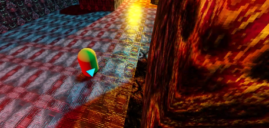
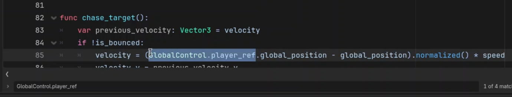

## [BACK](./../README.md)

## Part 2 - Adding Multiple NPC States and Line of Sight

Sup mophuckas!

In the last part, we created an enemy that constantly chases the player



While an enemy that constantly chases the player whether or not it sees them may provide some amusement, we will want to have more than only one state in order to create an interesting NPC.

-----

### Determining which logic belongs to "chase state"

The first overall goal is to determine in our code what logic is only apart of the chase state or not since that is the only state which we have created so far.

For instance, the `move_enemy()` function is chase state specific while something such as gravity should apply to all states.

In case we want to move the bounce logic around, though, I am going to move the bounce logic into its own function. I will call this function `bounce_enemy_on_walls()`:

```js
func bounce_enemy_on_walls():
    if get_slide_collision_count() > 0 && is_on_wall():
        is_bounced = true
        bounce_timer.start()
        for slide in get_slide_collision_count():
            var collision: KinematicCollision3D = get_slide_collision(slide)
            var collision_normal: Vector3 = collision.get_normal()
            velocity = Vector3(collision_normal.x, velocity.y, collision_normal.z) * speed
```

It simply contains what was inside the `_physics_process()` function before, but now we will call `bounce_enemy_on_walls()` in `_physics_process()` in place of the original code:

```js
func _physics_process(delta: float) -> void:
    if is_on_wall():
        is_currently_on_wall = true
        wall_timer.start()

    if !is_on_floor():
        velocity.y -= gravity * delta
    elif is_currently_on_wall:
        jump_if_available()
    else:
        velocity.y = 0.0

    move_enemy()
    bounce_enemy_on_walls()
```

Later on, we may change how the bounce function applies to the enemy based on state.

We saw some good results applying a simple bounce to a chasing enemy, but other states such as the idle state may need separate logic aside from this bounce functionality.

-----

### ActionState - Creating an enum for states

We will use an enum to represent multiple states.

I'll name the enum: `ActionState` and give it two states to start off with:
* `IDLE`  - The state in which the NPC does not see the target
* `CHASE` - The state in which the NPC is actively going after the target

```js
enum ActionState {
    IDLE,
    CHASE
}
var action_state: int = ActionState.IDLE
```

Note that we also have a variable named `action_state` defined under it which will be set to the state that we want to default to.

By default, the enemy will start off not seeing the target, so it is better to start off as `IDLE`.

The behavior for these states can be whatever we want, but the important thing is to have a clear separation between these states in code.

To aid with this separation, I'm going to rename `move_enemy()` to `chase_target()` to give a more clear separation that this is chase code only.

I will keep the `move_enemy()` name, but move it to a more generic function. One that will perform something different based off of the current value of `action_state`. I will eventually name this function to `perform_action_for_state()`, but at this point in the video, it is still `move_enemy()`.

```python
func move_enemy():
    match action_state:
        ActionState.IDLE:
            pass
        ActionState.CHASE:
            chase_target()
```

-----

If you switch the initial `action_state` back to `ActionState.CHASE`, then you should see the same chasing behavior as we were seeing in the last video.

And, if we set the initial `action_state` to `ActionState.IDLE`, then we should see only the `perform_look_at()` function doing anything since that functionality is still not tied down to any states.

The `ActionState.IDLE` state assumes that the NPC is not "seeing" the target as well, so we should only perform `perform_look_at()` in the `ActionState.CHASE` state.

To ensure that we know that this is a Chase state function, I will also rename this function to `perform_look_at_target()`.

-----

Also, if you have not done so yet, ensure that you have flipped the Arrow on the NPC to the negative Z-axis. This will allow us to not have to rotate the enemy around 180 degrees:
```python
func perform_look_at_target():
    # TODO: Need some way to set turn on look_at_timer outside of this function
    if not is_instance_valid(GlobalControl.player_ref):
        return

    # The commented code below can be removed after setting the arrow to point
    # towards the -Z axis

    look_at(GlobalControl.player_ref.global_position)
    look_at_timer.start()
```

However, there is an issue that you may see is that the enemy's entire body turns to look at you. This is because the enemy is rotating to look at you from all axes.

For the body, though, we only want to rotate on the NPC's y-axis. So, I will keep the previous rotation and use its y-axis to the NPC's rotation *after* the `look_at()` function like so:

```python
func perform_look_at_target(look_at_target: Node3D):
    if not is_instance_valid(look_at_target):
        return

    # TODO: add option to keep y rotation or not (for head?)
    # TODO: Keep horizontal only for body
    var previous_rotation: Vector3 = rotation
    look_at(look_at_target.global_position)
    rotation = Vector3(previous_rotation.x, rotation.y, previous_rotation.z)
```

-----

### Creating different targets for `look_at()` in IDLE and CHASE

Our only target that we are using for `look_at()` is the player at the moment, but it is better that we make a variable named `target_ref` instead that stores a reference to a `Node3D`. This is because we may want the NPC to target something besides the player such as another entity or even another player.

```js
var target_ref: Spatial = null
```

Inside the `_ready()` function, we are going to set the `target_ref` to the player reference stored in our `GlobalControl` singleton:
```js
func _ready() -> void:
    # rest of the function
    # ...

    target_ref = GlobalControl.player_ref
```

This will set the player as the `target_ref`'s reference by default.

Our next step is to go through all of our `GlobalControl.player_ref` throughout the script and replace each one with `target_ref` instead.



## [BACK](./../README.md)